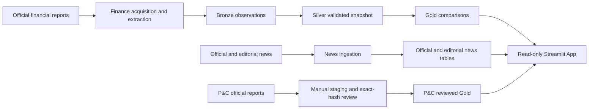

# Current-State Architecture Baseline

**Snapshot date:** 2026-09-29

**Repository:** `vigie_databricks`

**Reference revision:** `8de3601` on `main`, plus the uncommitted working-tree state described below

## 1. Purpose and authority

This document is the baseline reference for future Superpowers brainstorming,
design, and implementation plans. It describes the architecture observed in
the repository and identifies incremental migration opportunities. It does not
authorize a refactor, deployment, schedule change, publication, or live
workspace mutation.

The repository's executable code and configuration are the primary source of
truth for implemented behavior. Documentation that records live runs or
deployment state is historical evidence unless that state is verified again.

### Snapshot boundary

This is a **working-tree snapshot**. It is neither a clean-`main` snapshot nor
a verified-production snapshot.

At discovery time, `HEAD` and `origin/main` pointed to `8de3601`, while the
working tree contained substantial uncommitted P&C history and extraction work,
the chart-quality change in `apps/gold_viewer/history_quality.py`, and untracked
P&C period manifests and local diagnostic artifacts. The tracked diff covered
17 files and approximately 1,600 added lines. This baseline describes the
current files as observed, including those working-tree changes, because the
repository is the requested source of truth. It does not assert that those
changes are reviewed, committed, deployed, or active in production.

No Databricks Job, App, table, Volume, endpoint, schedule, or permission was
queried or changed during discovery. Statements about deployed resources are
therefore derived from checked-in manifests and historical documentation, not
fresh production verification.

## 2. System overview

The repository contains three related data products and one serving layer:

1. Life-insurer financial monitoring for MFC, SLF, GWO, and IAG.
2. Official and editorial news collection for those insurers.
3. An isolated Canadian P&C monitoring domain for IFC, AV, TD, and DFY.
4. A read-only Databricks Streamlit App with financial comparisons, history,
   provenance, news, operational status, P&C views, and bounded chat.

The package under `src/vigie_databricks` contains domain and data-processing
logic. Modules under `src/vigie_databricks/tasks` expose Python wheel entry
points. Databricks Job JSON files provide the operational task graphs. The App
under `apps/gold_viewer` reads published objects through a SQL Warehouse.

## 3. Life-insurer Finance architecture

### 3.1 Contract and configuration

`insurer_contract.py` loads versioned YAML files for companies, metrics,
approved financial sources, and Finance policy. It validates:

- supported company, metric, unit, comparison, and trend identifiers;
- `YYYY-Q1` through `YYYY-Q4` and `YYYY-AN` period identifiers;
- HTTPS source URLs and per-company host allowlists;
- candidate identity as `company-period-metric`;
- Unity Catalog Volume paths, retention periods, AI provider and call limits;
- one configured financial source for every company.

The main configuration is under `config/`. Policy defaults include a 365-day
raw-content retention period, bounded Model Serving fallback, a maximum of ten
AI calls per run, and live networking disabled by default at the contract
level. Job parameters can explicitly enable live execution.

### 3.2 Acquisition and extraction

The live acquisition path is:

1. Discover approved reports from configured investor-relations sources.
2. Select one latest report with an explicit period for each company.
3. Apply HTTPS host, redirect, content-type, size, and timeout bounds.
4. Reuse ETag and Last-Modified metadata when available.
5. Store fetched content by SHA-256 under the configured Unity Catalog Volume.
6. Extract text from PDF or HTML.
7. Run deterministic, issuer-specific KPI extraction.
8. Use bounded Databricks Model Serving fallback only when deterministic
   extraction produces no KPI.
9. Reject incomplete source or metric coverage before publication.

`financial_documents` stores document identity, URL, hash, retrieval metadata,
raw path, reporting period, status, and errors. `finance_run_audit` records
source coverage, retrieval counts, candidate counts, AI calls, retention, and
quality status.

### 3.3 Bronze

`bronze.py` ingests candidate observation batches into
`workspace.vigie.bronze_observations`.

- Rows are normalized to a fixed schema.
- Duplicate `observation_id` values in a batch resolve deterministically using
  ingestion time and a material payload hash.
- Delta `MERGE` inserts new observations and updates materially changed rows.
- An identical rerun is an operational no-op.
- Bronze retains the source observation grain rather than a comparison mart.

### 3.4 Silver

`silver.py` treats Bronze as the complete source snapshot for
`workspace.vigie.silver_observations`.

- Required identifiers are trimmed and normalized.
- Periods and finite numeric values are validated.
- Rejections receive deterministic, precedence-ordered reasons.
- Valid rows are deduplicated by `observation_id`.
- Silver synchronizes insertions, updates, and rows absent from the full Bronze
  source.
- Reconciliation compares Silver row count with distinct valid Bronze IDs.

The public API deliberately accepts a table name instead of a caller-provided
DataFrame so a filtered input cannot accidentally drive delete semantics.

### 3.5 Gold

`gold.py` builds `workspace.vigie.gold_observations` from the complete Silver
snapshot.

- The grain is company plus metric.
- Each row contains current and previous period/value, absolute and percentage
  changes, direction, and an audit hash.
- Period ranking supports quarterly and annual identifiers.
- Same-period duplicates are resolved deterministically.
- Gold uses full-snapshot insert, update, and delete synchronization.
- Reconciliation compares Gold rows with distinct Silver company-metric keys.

### 3.6 Historical Finance

Historical acquisition and publication are separate from the daily live path.
The flow uses:

- `financial_documents` for acquired report provenance;
- `finance_history_candidates` for extracted candidates;
- `finance_history_validated` for review results and quarantine reasons;
- `finance_history_publish_audit` for publication evidence;
- the shared Bronze, Silver, and Gold observation tables for accepted history.

Historical validation checks document identity, content hash, source
preference, period, metric, unit, accounting basis, value ranges, completeness,
and anomalous year-over-year changes. Missing or suspect metrics remain absent
or quarantined rather than being imputed. Its publication task records Delta
versions and restores the prior Bronze, Silver, and Gold versions if the
multi-layer update fails.

### 3.7 Live Finance transaction-semantics risk

> **High-visibility reliability constraint:** Live Finance is not proven to be
> cross-table atomic.

`tasks/finance_live.py` validates complete source and candidate batches before
the first observation-layer write. This protects last-known-good data from
known acquisition and validation failures. After validation, however, Bronze,
Silver, and Gold are advanced sequentially. A failure after Bronze or Silver
has been written can leave the three tables at different logical snapshots.
Unlike the historical publisher, the live task does not record versions and
restore all three tables on failure.

Accordingly, future documentation and plans must not describe live Finance as
cross-table atomic. The accurate current claim is: **pre-write batch validation
with per-layer reconciliation and sequential publication**. True atomicity or
compensating rollback must be designed and tested before stronger guarantees
are made.

## 4. News architecture

### 4.1 Legacy medallion News pipeline

The repository retains a complete News medallion path:

- `bronze_news`: bounded RSS/Atom retrieval, normalization, hashing,
  deduplication, and Delta merge;
- `silver_news`: normalized full snapshot;
- `news_ai_enrichment`: structured, bounded, idempotent Model Serving output
  with a per-run call budget and run audit;
- `gold_news`: join of Silver articles with successful enrichment.

Enrichment identity includes article content, prompt version, and model name.
Unchanged successful results are reused. Invalid output and budget-deferred
states are persisted rather than corrupting Silver. The checked-in legacy Job
template is paused.

### 4.2 Current official and editorial paths

The newer path writes two separate serving tables:

- `workspace.vigie.official_news` contains bounded official investor news and
  requires all four sources before persistent publication.
- `workspace.vigie.editorial_news` contains bounded industry media feeds,
  deterministic company references, categories, and a rolling retention
  window.

The App configuration points `GOLD_NEWS_TABLE` at `official_news`, indicating
that the newer official-news table is the current serving contract. Legacy
News tables and audit history remain present for compatibility and evidence.

Editorial source sufficiency is checked by the task after the loader returns.
Because the loader may already have written acquired rows, failure of the
minimum-source threshold is not a last-known-good transaction boundary. This
is a localized reliability issue to address when Editorial News is next
modified.

## 5. P&C architecture

The P&C domain is intentionally separate from life-insurer Finance.

### 5.1 Isolation

- Configuration lives under `config/pnc`.
- The issuer cohort is IFC, AV, TD, and DFY.
- Disclosure-scope rules are issuer-specific.
- Raw files use a separate P&C Volume.
- Staging uses `pnc_financial_documents`, `pnc_candidates`, and
  `pnc_run_audit`.
- Serving uses only `pnc_gold_observations`.
- Acquisition and publication remain manual and unscheduled.

### 5.2 Acquisition and review

Each manifest contains exactly one explicit document or supported unavailable
declaration per issuer. Acquisition is bounded to those entries. Documents are
hash-verified before extraction, and changed revisions remain distinguishable.

Extracted candidates begin with
`needs_period_and_accounting_basis_review`. A candidate becomes eligible only
when review evidence matches its company, period, document hash, metric, value,
unit, quarter basis, period end, and disclosure scope. Conflicting revisions
or values are rejected.

The design deliberately preserves explicit gaps:

- Aviva half-year or annual figures are not converted to quarterly values.
- TD combined Wealth Management and Insurance figures are not treated as
  standalone Insurance results.
- Trailing-period ROE is not treated as a quarterly KPI.
- Global or otherwise mismatched disclosure scopes do not substitute for the
  configured Canadian P&C basis.

P&C staging writes are sequential Delta upserts rather than a transaction
across staging tables. This is documented and acceptable while the workflow is
manual, review-gated, and unscheduled. It must be revisited before scheduling.

## 6. Serving layer

The Streamlit App under `apps/gold_viewer` is read-only.

- It connects through a bound Databricks SQL Warehouse.
- Table identifiers come from validated environment variables.
- Cached queries read Gold comparisons, Silver history, official and editorial
  news, document provenance, Finance audits, and operational alerts.
- The comparison view never substitutes an older KPI for the selected current
  quarter.
- Year-over-year deltas appear only when the exact prior-year quarter exists.
- Historical display-quality flags mask suspect chart points without changing
  source data.
- P&C is shown only when its feature flag and reviewed Gold table are present.

The chat service builds a bounded context from published rows and official
documents. Simple KPI questions use deterministic answers. Other questions use
a bound Databricks Model Serving endpoint with strict JSON parsing, citation
allowlisting, KPI allowlisting, and a deterministic fallback.

## 7. Operational monitoring

`operations_monitor` checks:

- the latest Finance audit is `current`;
- all four Finance sources succeeded;
- the latest completed quarter contains the expected KPI set;
- current-period validation has no rejected anomalies;
- the App and its compute are available.

It persists a health or alert audit when not in dry-run mode and fails the Job
when alerts exist, allowing Job failure notifications to act as the alerting
mechanism.

## 8. Deployment and environment assumptions

- Python is constrained to 3.12.
- Packaging uses Hatchling and Python wheel entry points.
- The current working-tree package version is `0.10.19`.
- Databricks serverless Job environments use environment version 5.
- Durable objects are expected under `workspace.vigie`.
- Finance and P&C raw storage require Unity Catalog Volume access.
- The App requires SQL Warehouse and Model Serving endpoint bindings.
- Production identities require table, schema, Volume, endpoint, and App
  permissions appropriate to their task.
- Several Job files include user-specific workspace paths, email addresses,
  job IDs, and historical wheel versions.
- `databricks.yml` is a placeholder with no resources; checked-in Job JSON and
  scripts are the practical deployment definitions.
- Live P&C follow-up currently depends on Databricks authentication that the
  repository documents as unavailable from the current workstation context.

Schedule and deployed-version claims in repository documents are not treated
as current facts without live verification.

## 9. Architectural conventions to preserve

The following decisions appear intentional and form the accepted legacy
baseline:

1. Keep business logic in `src/vigie_databricks` and task entry points thin.
2. Treat Unity Catalog Delta objects as durable data contracts.
3. Keep acquisition, extraction, validation, review, and publication distinct.
4. Validate complete batches before advancing published Finance observations.
5. Preserve last-known-good output on known source or candidate validation
   failures.
6. Use deterministic identity, hashing, merge behavior, and reconciliation.
7. Keep source allowlists and retrieval bounds in force.
8. Prefer deterministic extraction; bound, audit, and cache AI usage.
9. Keep the App read-only and prevent it from triggering data pipelines.
10. Preserve explicit `N/A` for missing or non-comparable evidence.
11. Keep P&C data, review, and publication isolated from the life domain.
12. Use full upstream snapshots for delete-capable Silver and Gold syncs.
13. Use Databricks Connect as the primary Spark/Delta integration gate.
14. Keep temporary integration-test objects isolated and clean them after use.

These are accepted legacy constraints unless evidence shows they are unsafe,
incorrect, or blocking an approved change.

## 10. Testing baseline

Pytest collects 218 tests from 43 files. The suite covers:

- pure domain contracts and validation;
- deterministic parsing and extraction fixtures;
- acquisition host, redirect, type, size, and request bounds;
- publication and last-known-good decisions;
- task argument and delegation contracts;
- App query construction, formatting, display rules, and chat guards;
- optional local Spark/Delta behavior;
- Databricks Connect integration for Bronze, Silver, Gold, News, and Finance;
- one Databricks runtime Bronze acceptance test.

Discovery ran the documented local gate excluding Databricks Connect and
runtime markers. The verified result was:

- 201 passed;
- 2 skipped because Java was unavailable for optional local Spark tests;
- 15 Databricks Connect/runtime tests deselected.

The first attempt encountered a Windows permission failure in pytest's default
temporary directory. Re-running with a new workspace-local `--basetemp`
succeeded. Pytest cache writes were disabled for the evidence run.

### First-class reliability gap: unenforced and incomplete quality gates

Correction verified on 2026-09-30: the committed `.github/workflows/ci.yml`
already runs on pull requests and pushes to `main`. It selects Python 3.12,
installs `.[dev,local_spark]`, and runs the local pytest gate excluding
Databricks Connect and runtime markers. This workflow existed at the baseline
reference revision; the original claim that CI was absent was incorrect. A
[pull-request run](https://github.com/jeplante/vigie-industrie-databricks/actions/runs/34727417086)
and a later [main push run](https://github.com/jeplante/vigie-industrie-databricks/actions/runs/36140553601)
both succeeded. Their pytest logs show no skipped tests.

The remaining automated-quality gap is still a primary reliability concern:

- GitHub reports `main` as unprotected, with no required status checks. A
  failing CI run therefore does not itself block a merge or direct push.
- Databricks Connect and runtime acceptance remain manual.
- No coverage threshold identifies untested production paths.
- No lint, format, import, or static-type gate detects basic regressions.
- The CI job uses dependency ranges rather than a lockfile, so later runs may
  resolve different versions.

The historical local result above remains evidence for the discovery-time
working tree only. The cited GitHub runs exercised committed revisions, not
the uncommitted working-tree changes or verified production state.

## 11. Agent context baseline

No repository `AGENTS.md`, Copilot instruction file, custom repository agent,
or custom skill was found. The CI workflow described above exists. Superpowers
provides the development workflow externally and should not be duplicated in
repository instructions.

### 11.1 Minimum permanent repository rules

If an `AGENTS.md` is added later, it should contain only stable repository
constraints:

- Preserve user changes; never reset or clean a dirty worktree.
- Read this current-state baseline before architectural work.
- Treat code and executable configuration as authoritative; treat live-status
  documentation as historical until verified.
- Use Python 3.12.
- Preserve published table contracts, read-only serving, P&C isolation,
  evidence review, and explicit missing-value behavior.
- Do not claim Live Finance cross-table atomicity.
- Run the fast local gate for code changes and the relevant Connect/runtime
  gate for Spark, Delta, deployment, or App integration changes.
- Do not enable schedules, publish reviewed data, or mutate live resources
  unless the task explicitly authorizes those actions.

### 11.2 Task-specific Superpowers workflows

The following remain selected per task rather than copied into permanent
instructions:

- brainstorming and design approval;
- implementation planning;
- worktree isolation;
- test-driven development;
- systematic debugging;
- code review;
- verification before completion;
- branch finishing and integration.

### 11.3 Agent and model routing

Routing is an orchestration concern, separate from architecture and repository
rules.

- Use a low-cost model at low or medium reasoning effort for inventory,
  mechanical searches, and routine test execution.
- Use a workhorse model for bounded implementation and code review.
- Reserve a frontier model for cross-domain architecture, ambiguous production
  failures, or high-risk publication and security logic.
- Every dispatched agent should receive an isolated context and explicit model
  and reasoning-effort settings. It should not silently inherit an expensive
  parent model.

No subagents were used for this baseline because the discovery was one coherent
read-only analysis rather than independent implementation tasks.

## 12. Documentation and implementation disagreements

1. `README.md` identifies package `0.5.0`; the working tree is `0.10.19`.
2. README says Slices 15-17 are unstarted, while official news, App experience,
   chat, operations monitoring, and deployment artifacts exist.
3. `docs/architecture.md` describes Silver and Gold as future work although
   both are implemented and deployed historically.
4. `PROJECT_HANDOFF.md` combines multiple dated checkpoints and stale next
   actions.
5. The legacy News Job template is paused while older documents describe its
   schedule as active.
6. `NEWS_DECOMMISSION.md` describes Official News as paused during validation,
   while its checked-in Job reset enables the schedule.
7. Job definitions pin wheels from `0.4.1` through `0.10.0`; the working-tree
   package is `0.10.19`.
8. The repository discusses Databricks Asset Bundle conventions, but
   `databricks.yml` contains no deployable resources.
9. This baseline originally said no CI workflow existed, although the
   committed workflow predates its reference revision. The correction in
   Section 10 records the verified state.
10. Some documents call live Finance publication atomic, while its current
    implementation does not provide cross-table rollback.
11. The original Gold News serving name remains the default in Python, while
    App configuration overrides it to `official_news`.

Future updates should correct the affected document when that operational area
is next modified. A repository-wide documentation rewrite is unnecessary.

## 13. Technical debt and migration candidates

| Candidate | Concrete problem | Impact | Risk of change | Expected benefit | Blocks upcoming work? | Timing |
| --- | --- | --- | --- | --- | --- | --- |
| Canonical baseline | Existing documents conflict and mix historical checkpoints | Agents and maintainers can act on stale assumptions | Low | Reliable starting context | Yes, for dependable future planning | Addressed by this document |
| Automated quality gates | CI runs local pytest, but `main` has no required status check; coverage, lint, type, and automated remote gates are absent | Regressions can merge despite a failing or absent CI result | Medium | Enforced minimum assurance | Yes, before broad concurrent development | Add a required CI status check as a separate bounded task |
| Live Finance transaction semantics | Bronze, Silver, and Gold advance sequentially without cross-table rollback | A mid-publication failure can leave inconsistent layer snapshots | High | Accurate last-known-good guarantee | Yes, before relying on atomicity or changing live publication | Address before the next live-publication change |
| Deployment consolidation | Job definitions, paths, versions, IDs, and parameters drift across files | Deployments are difficult to reproduce or audit | Medium | One reviewable deployment contract | Blocks repeatable deployment, not local work | Address during the next deployment task |
| P&C operationalization | Review publication is script-driven and staging writes are non-transactional | Scheduling would weaken current human-review safeguards | Medium | Safe repeatable P&C operation | Yes, for scheduling P&C | Keep manual until explicitly designed |
| News path reconciliation | Legacy medallion News and current official/editorial paths coexist | Unclear ownership, stale docs, unused tables and code | Medium | Simpler operations and clearer contracts | No | Address when News is next modified |
| Editorial source gate | Minimum-source failure may occur after persistent writes | A failed Job may still change its table | Medium | Last-known-good behavior for Editorial News | No | Fix opportunistically with regression coverage |
| Version synchronization | Package, README, Job wheels, and handoff versions drift independently | Operators can deploy unintended artifacts | Low | Traceable packaging and deployment | No | Add validation during deployment consolidation |
| Large modules | P&C extraction and App orchestration contain dense issuer/UI branches | Higher review and regression cost | Medium | Smaller testable units | No | Extract only while modifying the area |
| Hard-coded operational identifiers | User paths, email, job IDs, and object names are scattered | Environment coupling and manual edits | Medium | Safer promotion between environments | No | Parameterize with deployment consolidation |
| Test temp assumptions | Default Windows pytest temp/cache paths may be inaccessible | False-negative local gates | Low | Reproducible local verification | No | Add a documented or configured local temp convention |

## 14. Incremental migration strategy

Use an evidence-first incremental migration:

1. Use this baseline as the context for future Superpowers brainstorming.
2. Add only the minimum permanent repository rules when agent instructions are
   introduced.
3. Verify the existing CI gate on each change and decide whether its status
   should be required before merging.
4. Treat Live Finance transaction safety as its own high-risk bounded design;
   do not combine it with unrelated cleanup.
5. Consolidate deployment definitions when a deployment change is approved.
6. Preserve the manual P&C evidence gate until scheduled operation is designed
   explicitly.
7. Reconcile legacy and current News paths only after verifying the deployed
   consumers and retention requirements.
8. Refactor dense modules opportunistically, with tests, when their behavior is
   next changed.

Do not perform a repository-wide rewrite or force all three domains into one
pipeline shape. Their differences reflect distinct provenance, review, and
publication risks.

## 15. Unfinished work and next capabilities

- Acquire, exact-hash review, and publish eligible P&C 2022 comparative history
  through bounded unscheduled runs.
- Read back the deferred P&C Q2 2026 acquisition and reconcile its reviewed
  publication state.
- Reconcile remaining P&C period, issuer, and KPI gaps while preserving
  explicit unsupported periods.
- Reverify the currently deployed Job schedules, wheels, App state, table
  counts, and permissions before making operational claims.
- Decide whether to require the existing CI status check on `main`, and define
  a clear manual remote-integration gate.
- Decide whether legacy News code and tables remain supported evidence or can
  be retired after live verification.
- Replace scattered deployment manifests with a repeatable deployment source
  when deployment work is next authorized.
- Design and test Live Finance rollback or another explicit consistency model
  before claiming cross-table atomicity.

## 16. Baseline usage for future Superpowers work

Future tasks should begin by identifying which domain and durable contract are
in scope, then compare current files and live evidence with this snapshot.
Superpowers brainstorming should treat the working architecture as accepted
legacy and propose the smallest compatible change. Plans should name the
relevant local, Databricks Connect, runtime, or live acceptance gates and state
whether they modify publication or deployment state.

If current code, configuration, or freshly verified production evidence
conflicts with this baseline, update the baseline through a separate reviewed
documentation change rather than silently relying on the outdated statement.
