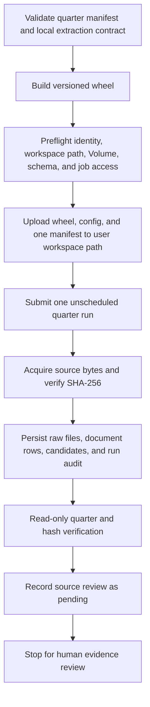

# P&C 2022 Comparative Backfill Through Staging — Design

**Date:** 2026-10-02
**Base revision:** `origin/main` at `7b9b874`
**Status:** Approved by user on 2026-10-02

## Objective

Acquire the eligible 2022 quarterly P&C source reports through the existing
manual workflow, stage their extracted candidates with exact source hashes,
and produce a quarter-by-quarter readback package for human review. The slice
covers 2022-Q1 through 2022-Q4. It ends with candidates in P&C staging and
source evidence documented as pending review.

The current checkout contains substantial uncommitted work and is behind
`origin/main`. Implementation will start in a clean worktree based on current
`origin/main`. The dirty checkout may be inspected for still-useful work, but
will remain untouched; only changes missing from current main may be ported.

The current-state baseline is a working-tree snapshot, not a verified
production snapshot. This design relies on current code and configuration for
implementation behavior. It makes no fresh claim about deployed resources.

## Current architecture and source policy

P&C acquisition is manual and separate from the Life Finance domain. The
quarter manifests under `config/pnc/history/` identify one source per issuer
and distinguish an unavailable quarterly disclosure from a report that is
expected to produce no standalone Insurance KPI.

For the 2022 comparative backfill:

- IFC candidates use restated 2022 comparative columns from quarterly issuer
  releases. The expected metrics per quarter are combined ratio, operating
  income, and net income.
- Definity candidates use the restated 2022 comparative columns. The expected
  metrics per quarter are insurance revenue, claims ratio, expense ratio,
  combined ratio, operating income, and net income.
- Aviva remains unavailable where only annual, half-year, group, or
  non-standalone disclosure is available. No value is inferred from those
  periods or segments.
- TD's quarterly report is acquired for evidence, but no standalone Insurance
  KPI is expected. A candidate from TD contradicts the manifest declaration
  and must stop the run for review.
- Parenthesized negative net income remains negative. Comparative values,
  accounting bases, and periods must not be inferred from adjacent columns.
- Comparative values in manifests or source-discovery documentation are
  expectations, not hash-bound approval evidence.

The eligible set is expected to contain nine candidates per quarter: three
from IFC and six from Definity. Each quarter should acquire three documents
(IFC, Definity, and TD); Aviva is explicitly unavailable. The source run
status is expected to be `acquired_needs_review`, with zero AI model calls.
These counts are acceptance checks, not permission to coerce the parser into
producing them. Any discrepancy stops the quarter for diagnosis.

## Proposed workflow

Before any remote writes, validate every 2022 manifest with the existing
`checked_manifest` contract and run the relevant local tests. Build the wheel
from the reviewed worktree. Confirm the authenticated workspace identity,
write access to the configured P&C Volume and staging schema, and permission
to upload to the submitting user's workspace folder and submit a one-time job.
If any prerequisite is missing or points to an unexpected target, stop before
upload or submission.

Submit one quarter at a time with
`scripts/submit_pnc_history.py --manifest <quarter-manifest> --profile
jeplante --run-token <unique-token> --submit`. The script uploads the wheel,
manifest, and P&C config into a versioned user-scoped workspace path and uses
the existing job template to submit an unscheduled run. Do not create or
modify a persistent Job, schedule, deployment manifest, or published table.
Each run has no automatic retries and is bounded by the template's timeout.
Record the returned job run ID and use it to query the run audit.

The task may write raw report files to the configured P&C Volume and upsert
`pnc_financial_documents`, `pnc_candidates`, and `pnc_run_audit`. These writes
are sequential, not transactional across tables. If a run fails or its audit
is absent, inspect the staging state before retrying. Never assume that a
failed run left no writes. Complete and verify one quarter before submitting
the next.

The acquisition code verifies the SHA-256 of fetched bytes before saving the
raw content and attaches the hash to each candidate. The readback must confirm
the audit row for the returned run ID, period-scoped candidate keys and
metrics, matching document hashes, and recorded raw paths under the configured
P&C Volume. The verifier must distinguish the run audit from period-scoped
candidate/document revisions: candidate rows do not carry a `run_id`, so the
result must not claim row-level job-run linkage that the schema does not
provide. Record the period's pre-run staging state so any earlier revisions
remain visible in the comparison.

The existing `scripts/verify_pnc_staging.py` reports global aggregates. Extend
it or add a focused read-only verifier with a required validated period input
and an optional validated run-ID input. Without a run ID, it records the
period's pre-run baseline. With a run ID, it also selects that exact audit row
and reports:

- the exact audit row and its status, document count, candidate count, AI-call
  count, missing-source list, and errors when a run ID is supplied;
- documents for the requested period, including issuer, source URL, content
  hash, acquisition status, and raw-content path;
- candidates for the requested period grouped by issuer, metric, and source
  hash, including duplicate keys and earlier source revisions;
- whether each candidate hash corresponds to a stored document revision for
  the same issuer and period.

All SQL identifiers must use the existing validated catalog/schema contract;
period and run-ID inputs must be validated before query construction. The
verifier is read-only and must not create tables, repair rows, or publish data.

Update `docs/PNC_SOURCE_REVIEW.md` with the run IDs, exact acquired hashes,
candidate outcomes, unavailable/unsupported gaps, and readback findings. Mark
the 2022 values and hashes as awaiting review. Do not update
`config/pnc/reviewed_evidence.yaml` or invoke the reviewed-only Gold publisher
in this slice.

## Acceptance criteria

### Local and CI

- Work occurs in a new isolated worktree based on current `origin/main`;
  existing uncommitted changes remain untouched.
- Ported changes are limited to behavior or tests still missing from current
  main.
- `checked_manifest` accepts each 2022 quarter and rejects malformed or
  mismatched period/issuer declarations.
- Deterministic extractor tests cover each quarter's comparative column,
  exact IFC and Definity metric keys, target-period context, and parenthesized
  negative net income. TD and Aviva remain zero-candidate cases for their
  declared reasons.
- Read-only verifier tests cover pre-run mode without an audit ID, valid and
  invalid period/run-ID input, period-scoped result construction, exact audit
  selection, duplicate source revisions, and candidate-to-document hash
  correspondence.
- The documented Python 3.12 local pytest gate passes. GitHub's required
  `unit-tests` check passes on the PR.

### Staging and source review package

For each of 2022-Q1 through 2022-Q4:

- the one-time run completes without acquisition errors and records an audit
  with `needs_review`, three acquired documents, nine candidates, and zero AI
  calls;
- the candidate set contains exactly IFC's three expected metrics and
  Definity's six expected metrics, with no TD or Aviva candidate;
- every candidate has the intended quarter, supported context, and source
  hash matching an acquired document revision for the same issuer and period;
- raw-content paths are recorded under the configured P&C Volume, and the
  acquisition's byte-hash check succeeded before persistence;
- the read-only verifier records the quarter's prior staging state and
  confirms the post-run audit, documents, candidate metrics, and hashes;
- review documentation records all run IDs, hashes, observed candidates, and
  gaps, clearly marked pending human review.

No candidate is promoted to reviewed evidence or Gold as part of acceptance.
The Git worktree contains no acquired report bytes, secrets, or generated
Databricks outputs. The only workspace effects are the uploaded artifacts in
the submitting user's versioned folder and the four one-time runs; this slice
does not create, modify, or delete a persistent Job or schedule. The PR
contains only code, tests, and documentation; GitHub CI passes before merge.

## Stop conditions and operational safeguards

Stop before remote writes if workspace identity, Volume or schema permissions,
workspace upload access, or one-time job submission access cannot be confirmed.
Stop a quarter if its source/hash, candidate set, target period, expected gap,
audit status, or readback differs from this design. Preserve partial writes
and inspect them before retrying; do not clean or overwrite staging data to
force the expected result.

After the four quarters are staged and the review package is complete, stop
for a human decision on source and accounting-basis acceptance. A later task
may update hash-bound reviewed evidence and publish Gold only after that
review and explicit authorization for publication.

## Parallel execution

The independent local tasks may be assigned in parallel after the clean
worktree and baseline tests are ready:

1. A Luna agent checks comparative parser and manifest test coverage, working
   only in the relevant test files.
2. A Luna agent implements or reviews the read-only staging verifier and its
   focused tests, working only in the verifier files.

Use `gpt-6-luna` at medium reasoning effort for these bounded tasks. Do not
inherit a higher-cost parent model. The integrating agent reviews both diffs,
runs the full local gate, and handles documentation. Remote quarter runs stay
sequential because they share staging tables and partial writes need inspection
before the next quarter proceeds.

## Out of scope

- Hash-bound approval entries in `reviewed_evidence.yaml`.
- Gold publication, Silver/Bronze changes, or publication rollback behavior.
- Changes to Live Finance, including any claim of cross-table atomicity.
- Scheduled Jobs, persistent Job changes, deployment manifests, or wheel
  promotion to a shared production location.
- Aviva or TD value inference, new issuer/metric scope, AI extraction, or
  committing issuer report bytes.
- Refactoring P&C architecture beyond changes required for this workflow and
  its verifiable readback.
